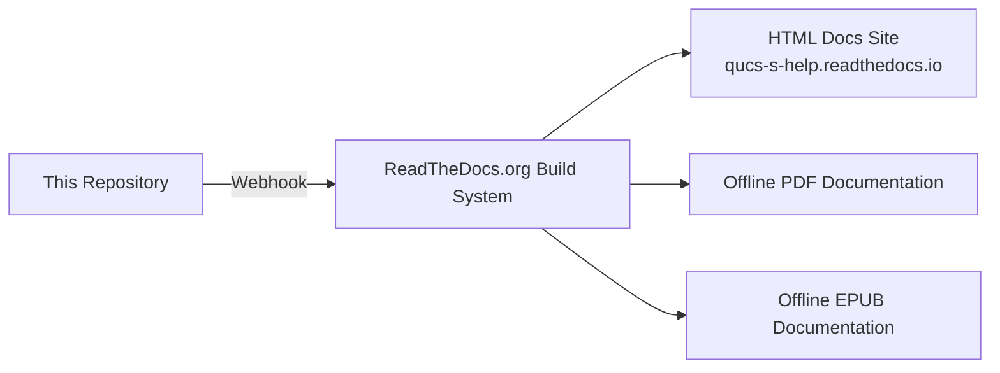

# QUCS-S Documentation

[](https://qucs-s-help.readthedocs.io/en/latest/?badge=latest)

Official documentation for the QUCS-S Circuit Simulator.

> This documentation is being substantially restructured/rewritten as of February 2025. To view the prior contents of ``https://qucs-s-help.readthedocs.io/``, see the ``legacy`` branch, [available here.](https://qucs-s-help.readthedocs.io/en/legacy/)

## Quick Links

### Available Documentation Formats
* [Searchable HTML Site](https://qucs-s-help.readthedocs.io/en/latest/)
* [PDF Download](https://qucs-s-help.readthedocs.io/_/downloads/en/latest/pdf/)
* [EPUB Download](https://qucs-s-help.readthedocs.io/_/downloads/en/latest/epub/)

All of the above formats are built automatically from this repository, by ReadTheDocs.

### Other QUCS-S Resources

* **[Main Project Site](https://ra3xdh.github.io/)**
* **[QUCS-S Source Repository](https://github.com/ra3xdh/qucs_s)**
  * **[Discussion Forum](https://github.com/ra3xdh/qucs_s/discussions)**
* **[Legacy Docs](https://qucs-s-help.readthedocs.io/en/legacy/)** : This is the former contents of ``https://qucs-s-help.readthedocs.io/``. It's largely outdated, and will not be maintained going forward, but it's preserved anyway for reference.
* **[Donate via Boosty](https://boosty.to/qucs_s)** : The QUCS-S project accepts donations via Boosty. These are for the project as a whole, not specifically for this docs repository.

## Repository Structure

These docs are made with Sphinx, and built/hosted with ReadTheDocs.



Critical files in the repository include:

* ``./source`` : Source files (mostly ReStructuredText) for the documentation.
  * ``conf.py`` : Main configuration file for Sphinx.
* ``.readthedocs.yaml`` : Main configuration file for the ReadTheDocs build system.
* ``requirements.txt`` : Python requirements file, used for ReadTheDocs build _and_ useful for setting up a local dev environment to contribute to these docs.
* ``make.bat`` and ``Makefile`` : Convenience files to trigger Sphinx documentation builds.
* ``.github/workflows/pr-preview-links.yaml`` : GitHub Action to automatically add an HTML docs preview link to a new pull request. This works with the "Pull Request Builds" feature in ReadTheDocs. If you create a PR, your docs will automatically be built by ReadTheDocs (HTML format only, not EPUB or PDF) and a link appended to the pull request description.

## Contributing

Contributions are welcome via Pull Request!

**If you are unfamiliar with Git/Sphinx/ReStructuredText, you can still contribute!** [Submit an Issue](https://github.com/ra3xdh/qucs_s-help/issues/new) describing your contribution, and attach any documentation files you've written. Another developer can take your content and integrate it into this repository.

### Setting Up Local Build Environment

To be able to build docs locally, you will need to install all the Python packages listed in ``requirements.txt``. Beyond that, all you need is a text editor and a Git client.

On Windows, we recommend:
* Visual Studio Code
* Conda Python Distribution (Install the [MiniConda version](https://docs.anaconda.com/miniconda/) unless you need full Conda for other purposes)
* [Git For Windows](https://git-scm.com/downloads/win)

Once you have these things, clone your fork of the repository, and run the commands below to create a new Conda virtual environment, and install the necessary Python packages.

```
conda create -n qucs_s_help_readthedocs python=3.11
conda activate qucs_s_help_readthedocs
pip install -r requirements.txt
```

If the commands above were successful, you should be able to run ``make html`` (or ``.\make.bat html`` if you're on Windows) and Sphinx will build the HTML documentation site. Any Sphinx build outputs will be stored in the ``./build`` directory, which is ignored by Git.

For a general introduction to Sphinx documentation and ReadTheDocs, see [this excellent YouTube video](https://www.youtube.com/watch?v=PO4Zd-6a6fA).
