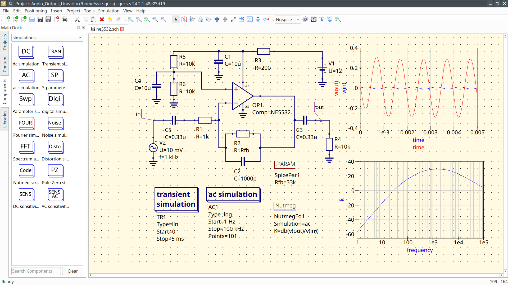

.. QUCS-S Documentation master file, created by
   sphinx-quickstart on Tue Feb 11 20:45:43 2025.
   You can adapt this file completely to your liking, but it should at least
   contain the root `toctree` directive.

Welcome to the Qucs-S Documentation!
==========================================

Qucs-S is a circuit simulation program, forked from the original `Qucs circuit simulator. <https://qucs.sourceforge.net/>`_

Qucs-S aims to provide a convenient, unified GUI around various free circuit simulation kernels (such as ngspice, Xyce, Qucsator, etc). It merges the power of SPICE with the simplicity of the Qucs GUI.

   
   An example of an NE5532 amplifier simulated in Qucs-S, using the ngspice simulation backend.

You may wish to:

* `Download Qucs-S <https://ra3xdh.github.io/>`_
* `View Qucs-S Source on GitHub <https://github.com/ra3xdh/qucs_s>`_
* `Discuss in the Project Forum <https://github.com/ra3xdh/qucs_s/discussions>`_
* `Donate to the project via Boosty <https://boosty.to/qucs_s>`_
* `View Legacy Documentation (largely obsolete, but maintained for reference) <https://qucs-s-help.readthedocs.io/en/legacy/>`_

Please be advised that this documentation is a work-in-progress. However, if you find an error in this documentation, please `submit an issue on the docs repository on GitHub. <https://github.com/ra3xdh/qucs_s-help/issues/new>`_ Pull requests are also welcomed!

Otherwise, continue on through this documentation to learn more about QUCS-S.

.. toctree::
   :maxdepth: 4
   :caption: Welcome
   :hidden:

   /welcome/what-is-qucs-s

.. toctree::
   :maxdepth: 4
   :caption: Installation
   :hidden:

   /installation/installing-qucs-s
   /installation/installing-sim-backends

.. toctree::
   :maxdepth: 4
   :caption: Overview
   :hidden:

   /overview/interface-overview
   /overview/understanding-file-structure
   /overview/choosing-a-sim-backend
   /overview/simulation-types/index
   /overview/equations-and-parameters/index
   /overview/displaying-results

.. toctree::
   :maxdepth: 4
   :caption: Using Subcircuits & External Models
   :hidden:

   /subckts-and-ext-models/working-with-subcircuits
   /subckts-and-ext-models/spice-models/index

.. toctree::
   :maxdepth: 4
   :caption: Using and Managing Libraries
   :hidden:

   /libraries/index

