# Qucs-S: A Guide to Using SPICE Models and Creating Libraries

> Translated from original Russian tutorial, [here](https://habr.com/ru/articles/805963/)

## Working with Subcircuits

The easiest way to add new components is to create a subcircuit. As an example, let's look at how to create a component representing a dynamic head. The latest version of Qucs-S includes the Loudspeakers library, which contains speaker models. Here we will analyze how this library is made. It is known that a speaker has a complex impedance dependence on frequency and is described by an equivalent circuit, which can be represented as an RCL circuit. In this article, we will use the model given [here](https://translate.google.com/website?sl=auto&tl=en&hl=en&client=webapp&u=https://circuitdigest.com/electronic-circuits/simulate-speaker-with-equivalent-rlc-circuit) :

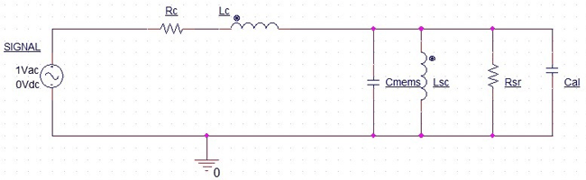

The components Rc and Lc can be measured directly, as they represent the nominal resistance and inductance of the speaker coil. The values ​​of the remaining components in the diagram depend on the geometric dimensions and mass of the diffuser and the mechanical parameters of the speaker design, and are calculated according to the formulas in the article above. To avoid cluttering this article, the mathematics are not presented here.

To add a component representing a dynamic head, first create a new schematic document (menu File → New schematic) and draw an equivalent circuit in it. You need to place equations on the circuit. For this, use a special component .PARAM section, which sets the SPICE parameters and is located in the SPICE netlist sections or Equations group. In the SPICE netlist, parameters are called equations that are calculated before the simulation starts. If you want the new component to work with the Qucsator modeling engine as well as with SPICE, then instead of the .PARAM section, you should have a different type of equation, namely the Qucs legacy equation (located in the equations section). But in this case, only a limited set of mathematical functions is supported, which is compatible with both SPICE and Qucsator. It is also important to place the subcircuit ports, which can be inserted using the Insert → Port menu or via the button on the toolbar. The speaker has two ports P1 and P2. The result should be the following circuit, which we save as SPK.sch


After the circuit is assembled and the equations are set, you need to create a UGO for the speaker. To do this, press F9 on the keyboard or in the menu File→ Edit circuit symbol. The symbol editor opens. By default, Qucs-S automatically creates a UGO in the form of a square, which should be edited. Using graphic primitives, you can draw a UGO.

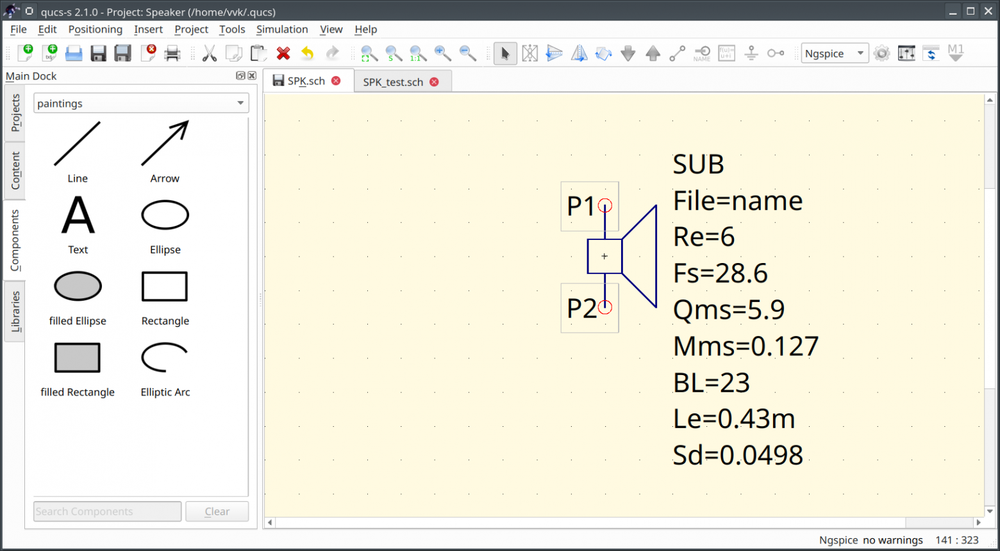

There is some text next to the UGO blank. Double-clicking on this text opens a dialog where you should set the parameters of the subcircuit. The interface here is intuitive and allows you to enter parameter names, default values, and descriptions. For the speaker, you should set the parameters as shown in the following screenshot.


The Qucs-S distribution includes UGO templates. They are located inside the directory where the program is installed in the subdirectory share/qucs-s/examples/symbols in the file schematic_symbols.sch. You can open the file and copy the template.

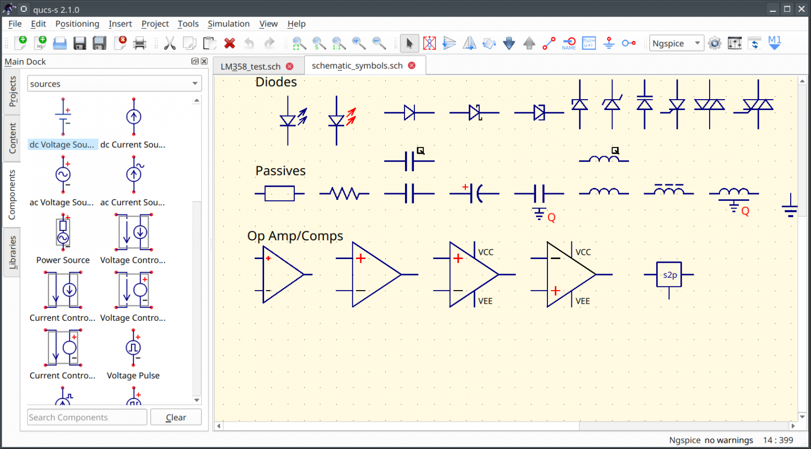

After the UGO has been created and the parameters have been set, the document should be saved. Now you can test the subcircuit. To do this, create a new circuit and place the Subcircuit component on it, which is in the file components group. The first parameter of this component should be the path to the subcircuit file. In this case, it is SPK.sch. The UGO and the list of parameters will be loaded automatically. You should get the test circuit shown in the figure. In addition to the speaker, it has an AC source V1, simulation, and an equation that specifies the impedance calculation. The node where the speaker is connected to the source should be marked as n1. Run the simulation and get a graph of the speaker impedance Zd versus frequency in the range from 1 Hz to 20 kHz.

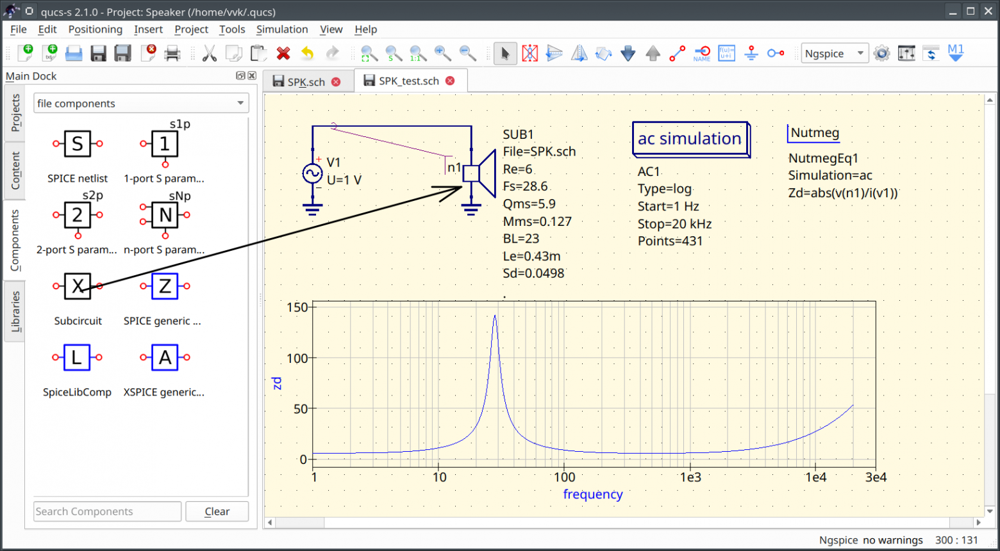

## Using SPICE Models in Qucs-S

Most electronic component manufacturers provide models for their transistors and microcircuits, which are distributed as a SPICE netlist. These models can then be used in SPICE-compatible simulators. Existing SPICE models can be divided into two types:

1. Discrete component models (modelcard) are provided as a .MODEL directive, which contains the name and parameters of the model.
2. The chip models are provided as a .SUBCKT subcircuit.

### Importing SPICE models in version 24.3.0 and higher

Starting with version 24.3.0, the procedure for importing SPICE models has been significantly simplified. But what is described in the following sections will also work. However, in new versions it is recommended to use the new method.

### Discrete Component Models in Version 24.3.0 and Later

In the latest versions of the program, the Fill FromSPICE model button has been added to the properties dialog for all unified discrete semiconductor components (blue UGO symbol) . Clicking on the button opens a dialog box where you should insert the model text (.MODEL). The model (.SUBCKT) subcircuit is not accepted here. If you click OK, the program will automatically analyze the model and fill in the corresponding property fields for the component on the diagram. If you activate the Convert number notation option, the numbers will be converted to engineering notation (for example, 1.5e-12 to 1.5p). This procedure is illustrated by the screenshot. For field-effect transistors and diodes, everything is similar.

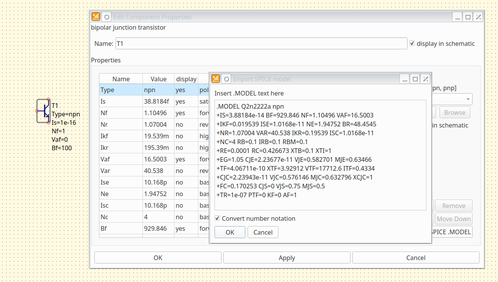

### Importing chip models in version 24.3.0 and higher

Starting with version 24.3.0, the Spice Library Device component has been reworked. Now this component allows you to connect a SPICE model, set the UGO symbol and pin correspondence in a convenient way. As an example, we import the model of the popular LM358 op amp: https://github.com/rene-dev/stmbl/blob/master/hw/spice/LM358.lib

Place the Spice Library Device component in the File components group on the circuit diagram and double-click it to open its properties dialog box. In the SPICE library field , specify the path to the LM358.lib file containing the model. Select the subcircuit name from the Subcircuit drop-down list . There is only one subcircuit in the LM358.lib file, but this method allows you to use libraries from several subcircuits. You can see the source code of the model in the preview window. Then you should specify the UGO. Select the Symbol from template option and select the opamp5t UGO template from the list on the right. This is an op amp with five pins.

Then, in the table, you should set the correspondence between the UGO pins and the SPICE subcircuit. The left column will contain the names of the subcircuit terminals from the .SUBCKT header, and the right column will contain the UGO pin numbers. So far, NC (not connected) is everywhere. Double-clicking on the NC field opens a drop-down list from which you can select the UGO pin number. The process is illustrated by the screenshot.

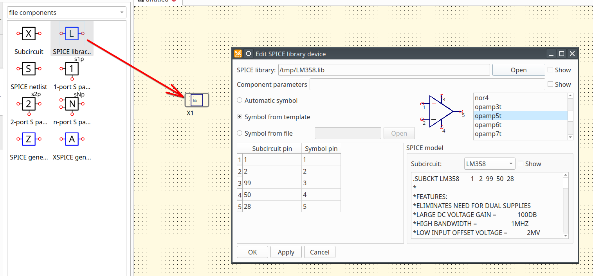

After the UGO and pins are set, click OK to update the component view. You can assemble the test circuit and run the simulation.

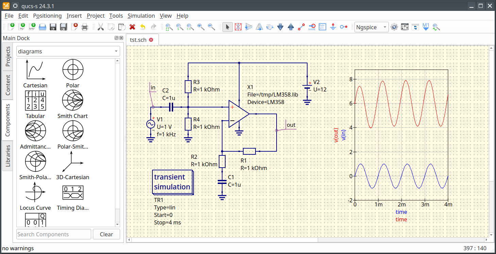

If there is no suitable UGO template in the program, you can draw your own and use it by specifying it in the Symbol from file dialog. A new symbol can be created using the File->New symbol command and then saved as a file with the SYM extension. When editing a symbol, terminals should be added using the Inser->Insert port menu command.

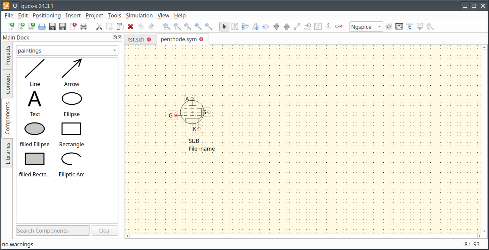

### Using Discrete Component Models

The Qucs-S library contains quite a lot of models of bipolar and field-effect transistors and even domestic components. But sometimes it is necessary to use a third-party model found on the Internet. The necessary actions for this are considered below.

SPICE models of diodes and transistors are usually distributed as a text file containing model cards (modelcard .MODEL). The format of the model cards and description of the parameters can be found in the documentation for the simulator. Models are obtained using a special extraction procedure, which requires measuring the component's I-V characteristics. In general, the parameters from the datasheet are not enough to obtain a SPICE model of a transistor. So if the manufacturer has not provided a model for its transistor, then nothing will help. Consideration of model extraction is beyond the scope of this article. Here is a link for those interested, which can be used to find a method for extracting the parameters of a field-effect transistor (MOSFET) model https://huskiecommons.lib.niu.edu/cgi/viewcontent.cgi?article=5043&context=allgraduate-thesesdissertations .

Let's look at an example of how to use a SPICE model together with the Qucs-S simulator with the Ngspice modeling engine. Below is a model of the popular bipolar transistor 2N2222

```text
.model 2N2222A NPN (Is=14.34f Xti=3 Eg=1.11 Vaf=74.03 Bf=255.9 Ne=1.307 
+ Ise=14.34f Ikf=.2847 Xtb=1.5 Br=6.092 Nc=2 Isc=0 Ikr=0 Rc=1 Cjc=7.306p
+ Mjc=.3416 Vjc=.75 Fc=.5 Cje=22.01p Mje=.377 Vje=.75 Tr=46.91n Tf=411.1p
+ Itf=.6Vtf=1.7 Xtf=3 Rb=10 Vceo=40)
```

Obviously, you can insert these parameters into the transistor model in Qucs-S manually. But the program also provides other ways to use the SPICE model. In the SPICE netlist section group, there is a special .MODEL component that allows you to place a model card on the circuit. You can copy the model text line by line into the properties of this component (Line_1, Line_2, etc.). This is what you should end up with:

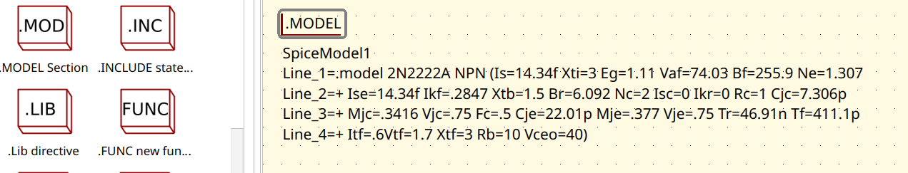

Now, to use the model, you will need a special transistor component that supports the full SPICE specification. All components in Qucs-S are divided into two groups:

1. The blue components are unified and work with both the Qucsator and Ngspice engines.
2. Red components are SPICE-only, but allow the use of the full SPICE specification.

We place a red transistor (Q NPN BJT) on the diagram and enter the model name 2N2222A into its properties. The screenshot shows a test circuit with such a transistor, which simulates a family of output I-V characteristics.


In addition to using the .MODEL directive, you can include a text file with the entire models using the .INCLUDE directive. An example is shown in the screenshot. You can also place the file with the transistor models in the $HOME/.qucs/user_lib directory and copy the model to the circuit by dragging and dropping.


### Using Integrated Circuit Models

Models of complex microcircuits are usually supplied as subcircuits. To obtain such a SPICE model, it is necessary to carry out measurements and extract parameters. Here again, if the manufacturer has not provided a model, then nothing will help. As an example, let's consider how to use the LM358 operational amplifier model in Qucs-S. This component is available in the program library, but was chosen because the model is not very complex. Below is the source code of the model that needs to be integrated into Qucs-S. The correspondence between the subcircuit nodes and the op amp output is given in the comments in the model file header. Comments in SPICE netlist files begin with the * symbol.

```text
*LM358 DUAL OPERATIONAL AMPLIFIER MACRO-MODEL
* connections:      non-inverting input
*                   |   inverting input
*                   |   |   positive power supply
*                   |   |   |   negative power supply
*                   |   |   |   |   output
*                   |   |   |   |   |
.SUBCKT LM358       1   2  99  50  28
****************INPUT STAGE**************
IOS 2 1 5N
*^Input offset current
R1 1 3 500K
R2 3 2 500K
I1 99 4 100U
R3 5 50 517
R4 6 50 517
Q1 5 2 4 QX
Q2 6 7 4 QX
*Fp2=1.2 MHz
C4 5 6 128.27P
***********COMMON MODE EFFECT***********
I2 99 50 75U
*^Quiescent supply current
EOS 7 1 POLY(1) 16 49 2E-3 1
*Input offset voltage.^
R8 99 49 60K
R9 49 50 60K
*********OUTPUT VOLTAGE LIMITING********
V2 99 8 1.63
D1 9 8 DX
D2 10 9 DX
V3 10 50 .635
**************SECOND STAGE**************
EH 99 98 99 49 1
G1 98 9 POLY(1) 5 6 0 9.8772E-4 0 .3459
*Fp1=7.86 Hz
R5 98 9 101.2433MEG
C3 98 9 200P
***************POLE STAGE***************
*Fp=2 MHz
G3 98 15 9 49 1E-6
R12 98 15 1MEG
C5 98 15 7.9577E-14
*********COMMON-MODE ZERO STAGE*********
*Fpcm=10 KHz
G4 98 16 3 49 5.6234E-8               
L2 98 17 15.9M
R13 17 16 1K
**************OUTPUT STAGE**************
F6 50 99 POLY(1) V6 300U 1
E1 99 23 99 15 1
R16 24 23 17.5
D5 26 24 DX
V6 26 22 .63V
R17 23 25 17.5
D6 25 27 DX
V7 22 27 .63V
V5 22 21 0.27V
D4 21 15 DX
V4 20 22 0.27V
D3 15 20 DX
L3 22 28 500P
RL3 22 28 100K

.MODEL DX D(IS=1E-15)
.MODEL QX PNP(BF=1.111E3)

.ENDS
```

First, copy the model text and save it to the LM358.cir text file. To use SPICE models defined by subcircuits in Qucs-S, there is a SPICE file component. Immediately after placement on the circuit, this component looks like a square without pins. Double-clicking on the SPICE file component opens a properties dialog box, in which you should specify the path to the LM358.cir file. To do this, click the Browse button and select the file. Qucs-S reads the model file and fills the list of SPICE net nodes. These nodes should be moved to the Component ports list using the Add button. The result should be as shown in the screenshot.

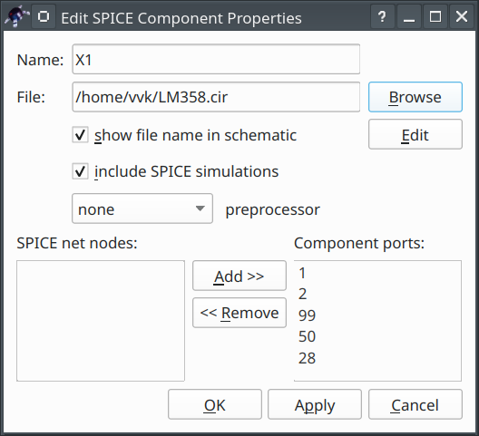

Now we press OK and see that the component's appearance on the diagram has changed. It now has terminals. The op-amp model can be tested right now. To do this, we will assemble a non-inverting voltage follower. The result of the operating point simulation (called by pressing F8 or the Simulation→DC bias menu) is shown in the screenshot. It is clear that the voltage at the follower output is approximately equal to the voltage at the input.

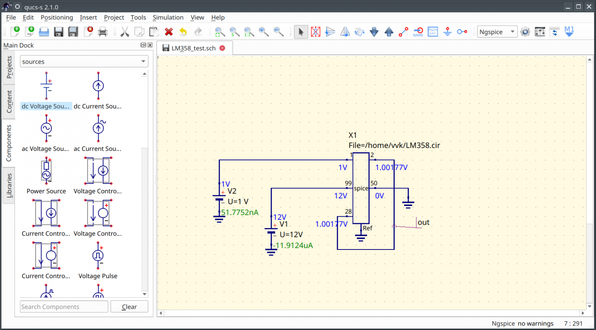

To create a UGO for a SPICE component, you need to wrap it in a subcircuit. Create the LM358.sch file and add the SPICE file component to it. Again, specify the path to the LM358.cir model file in the properties and fill in the Component ports list. Now you need to connect the subcircuit ports to the component pins, and then switch to the symbol editor mode by pressing F9. Draw the UGO using primitives and get the result shown in the screenshots. This component has no parameters, and you do not need to set them. Now save the LM358.sch file. The resulting component can be inserted into another circuit using the Subcircuit component.

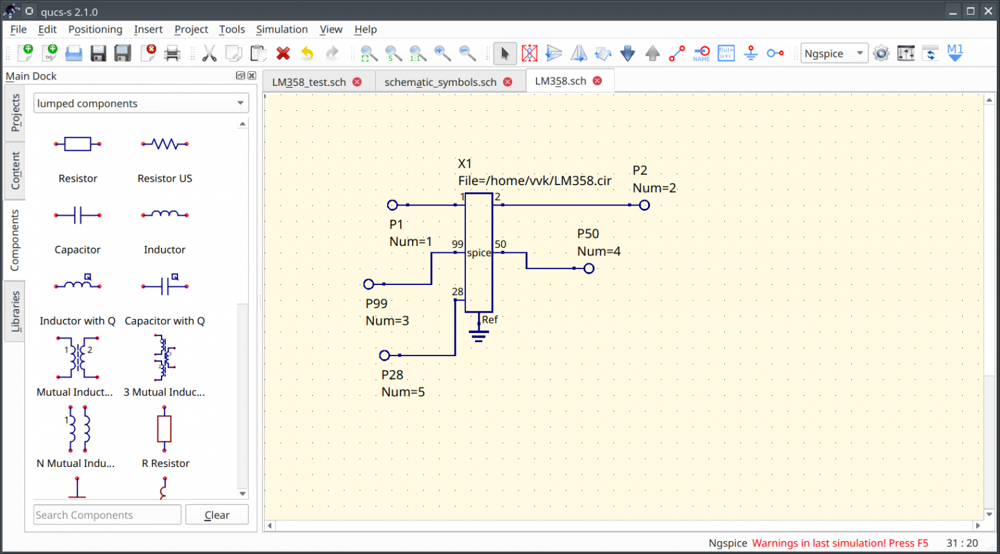

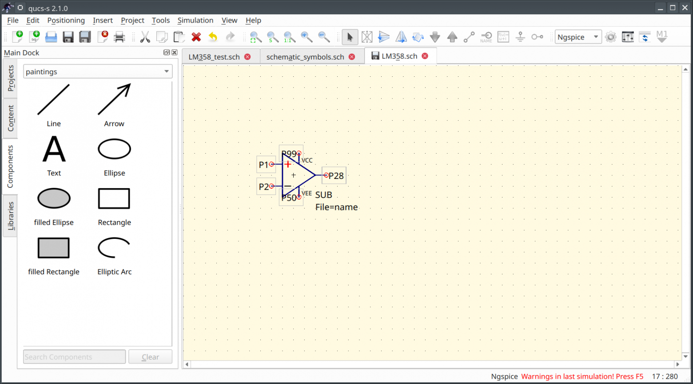

The screenshot below shows an example of modeling a non-inverting AC amplifier with a single-supply supply.


### QucsConv Utility

The Qucsonv utility is a file converter that allows, among other things, to convert a library of SPICE models to a Qucs library. This utility works in command line mode and can only convert a library consisting entirely of modelcards. For example, this one: https://ltwiki.org/index.php?title=Standard.bjt

Starting with version 24.2.0, the qucsconv utility is again included with the program. It also has an improved graphical interface. The utility can be launched from the Tools menu by selecting Data File converter. The interface is intuitive. To convert a SPICE library to a Qucs library, select SPICE netlist and Qucs library from the drop-down lists, specify the input and output files, and then click the Convert button.

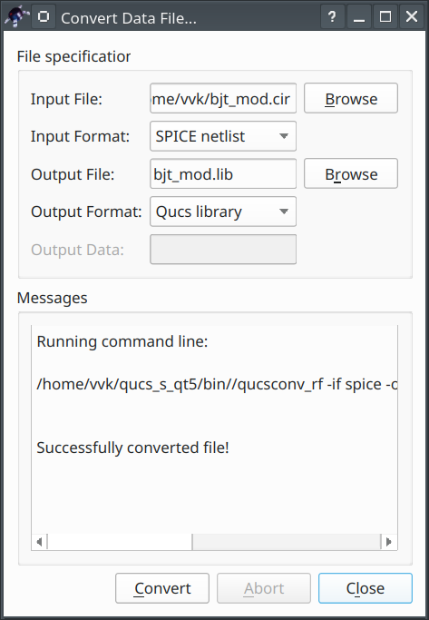

### SPICE Compatibility Modes

The netlist syntax in most modern simulators, including Ngspice, follows the SPICE-3f5 standard. But proprietary SPICE simulators, such as LTSpice or PSPICE, often have extensions to the standard and additional components. For example, the LTSpice netlist supports the IF operator, while Ngspice implements a ternary operator instead. To use some models from LTSpice or PSICE in Ngspice, you must either edit the model manually or switch Ngspice to compatibility mode. You can read more about compatibility modes in the Ngspice manual https://ngspice.sourceforge.io/docs/ngspice-html-manual/manual.xhtml#magicparlabel-23836 It should be noted that the compatibility mode with Ltspice does not implement 100% compatibility, so some models will not work. Here, all questions should be addressed to the Ngspice developers.

To enable compatibility mode in Qucs-S, use the special component Spiceinit section. The screenshot shows how to use it. Here we see a diagram with a model of the popular TDA2003 power amplifier chip. This model is created for LTSpice and requires setting the compatibility mode. The Spiceinit component contains the line set ngbehavior=ltpsa


### How to create your own library

Libraries in Qucs-S have a text format close to XML. Files of system libraries with the extension *.lib are located in the directory share/qucs-s/libraries in the root of the program installation. To create your own library, you need to convert a project containing SCH files with subschemes. Let's consider this process using an example and create a NewLibrary project. To do this, click Project→New Project in the main menu. If you plan to create a library, then the necessary schemes can be created and saved immediately in the project.

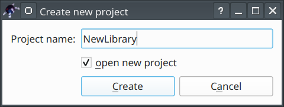

Click Create, and an empty project will open. In the future, the created projects can be found in the Projects tab on the left side of the program window. Next, you need to copy the files that we created in the previous sections to the directory with the project. By default, projects are located in the directory in the user's home directory in the $HOME/.qucs subdirectory. The full path to the project is $HOME/.qucs/NewLibrary_prj. Open this directory in the file manager and copy the LM358.sch and SPK.sch files there. Next, you need to update the project tree. To do this, close the project (Project→Close), and then open it again by double-clicking on the NewLibrary_prj project in the list on the panel on the left side of the window on the Projects tab. Now we see two schemes in the Schematics item. You can proceed to creating the library.

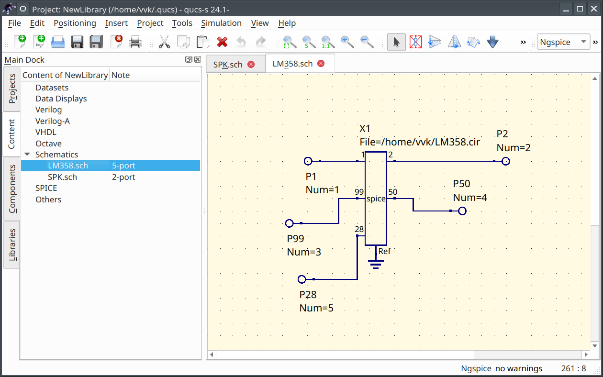

To create a library, select the menu item Project→Create Library. A dialog box opens. In the field at the top, enter the name of the future library and select the subcircuits to be included in the library from the list. The result is shown in the screenshot.


When the library name is set and the subcircuits are selected, click Next. In the next dialog, you can set a description for the components. Enter something in the description text and when the components are finished, click Create.

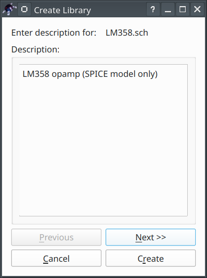

The following dialog box is displayed, informing you that the library has been created. The "no digital model" errors can be ignored. They indicate that there is no Verilog/VHDL digital model for our components. An analog component does not require one.

The new library is now displayed in the User Libraries list on the Libraries tab on the left side of the window. The library file can be found in the $HOME/.qucs/user_lib directory. This is the default search path for user libraries. Now you can replace the OU component in the test circuit with a component from the newly created library. We see that the simulation result did not change after replacing the component.

## Conclusion

The article discussed how to connect SPICE models and create your own libraries in Qucs-S. During the time the article was written, two releases were released, but the procedure for creating a library and using third-party models did not change. So everything written is relevant for the latest release 24.2.1